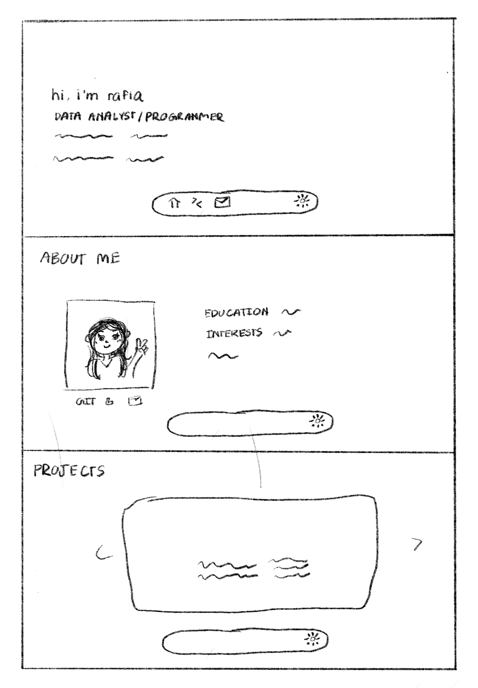
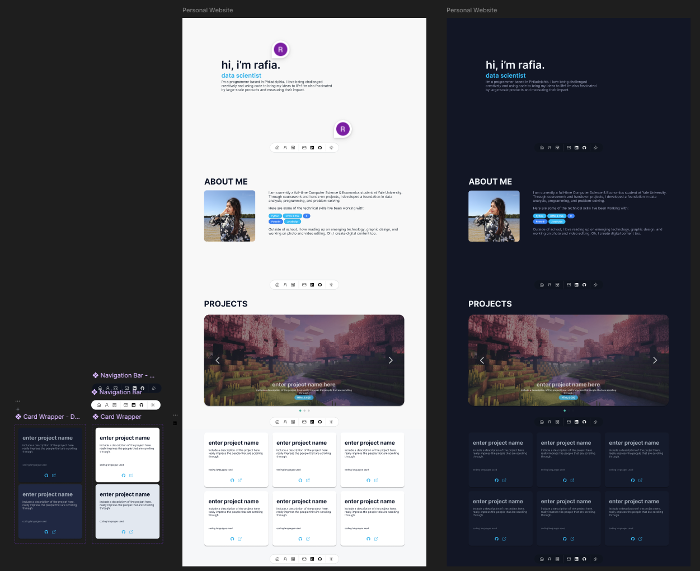

# Rafia's Website — v1.0

My personal site — designed in Figma, built from scratch with HTML, CSS, and JavaScript. This is the first draft of my site and still very much a work in progress! I plan to rebuild this in React down the line to add more interactive visuals and animations.

🔗 **Live site:** [rafiamobashira.com](https://www.rafiamobashira.com)

---

## Design Process

The design started with rough sketches on my iPad to get the layout and feel down before moving into Figma to build out the full prototype. The navigation bar was inspired by iOS's icon-based dock and wanted to bring that same feel to the web. As an avid dark mode user, I also designed and built a dark mode toggle.

  

The favicon was designed in Blender.

 

**Figma prototype:** [view here](https://www.figma.com/proto/G6zNlEWwnqXnY5jDVMQBgZ/Rafia-s-Website?node-id=0-1&t=CkydXW6sPvmd15h7-1)

<table>
  <tr>
    <td></td>
    <td></td>
  </tr>
</table>

---

## Roadmap

- [ ] Rebuild in React
- [ ] Add animations and interactive visuals
- [ ] Add a blog or writing section

---

Built & designed by Rafia Mobashira
